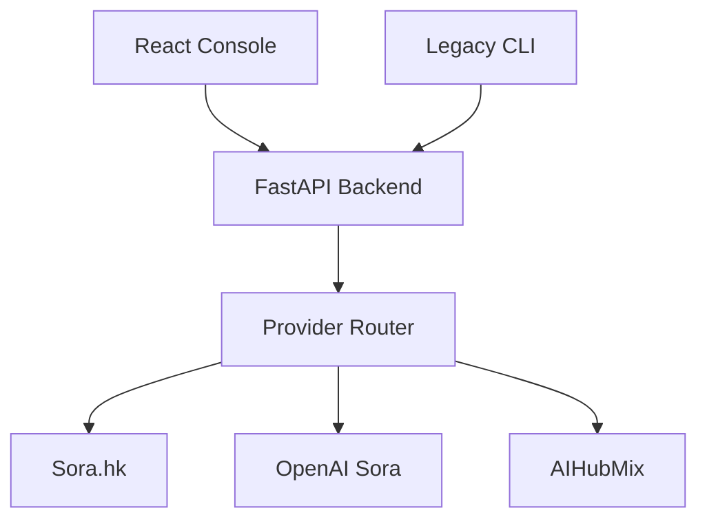

# 🌊 CineFlow - Video Generation Platform (CLI + Web Console)

[](https://www.python.org/)
[](LICENSE)
[]()

[**中文文档 (Chinese Docs)**](README_zh.md)

**CineFlow** is an open-source platform for storyboard-driven video generation. It now includes a **FastAPI backend** and a **React/Vite admin console**, while the original **CLI pipeline** remains available for legacy workflows.

---

## ✅ Current Status (Beta)

- Web console + backend API are fully wired for a **minimum closed loop** (upload → edit → run → retry → download).
- Multi-provider abstraction is in place (Sora.hk / OpenAI / AIHubMix).
- Real provider download has been verified.

Commercial-grade requirements (i18n coverage, admin controls, persistence, observability, auth UX) are **not complete yet**. See the delivery plan below.

---

## 🧭 Architecture (Web + API + Providers)



---

## ✨ Key Features (Current)

- **Storyboard workflow**: upload, list, edit segments, run generation.
- **Run & task management**: status tracking, retries, metadata download.
- **Provider routing**: logical model ID → provider mapping with failover/weighted strategy.
- **Admin controls**: enable/disable providers, enable/disable logical models.
- **i18n**: zh-CN / en-US baseline (still needs full coverage).

---

## 🚀 Quick Start (Web Console)

### 1) Backend (FastAPI)
```bash
python3 -m venv venv
source venv/bin/activate
pip install -r requirements.txt

# Start API
uvicorn backend.app.main:app --host 127.0.0.1 --port 8088
```

### 2) Frontend (React + Vite)
```bash
cd frontend
npm install
VITE_API_BASE=http://127.0.0.1:8088/api/v1 npm run dev
```

If `AUTH_TOKEN` is enabled in `.env`, also set:
```bash
VITE_AUTH_TOKEN=your_token_here
```

Open: `http://127.0.0.1:3000/`

---

## ⚙️ Configuration (.env)

Create a `.env` file with required variables:

```ini
SORA_API_KEY=...
OPENAI_API_KEY=...
AIHUBMIX_API_KEY=...

AUTH_TOKEN=         # optional, enables Bearer auth
CORS_ALLOW_ORIGINS=*
```

---

## 🧪 Validation & Acceptance

- Real provider download validation: `docs/backend_integration_acceptance_actual.md`
- API draft: `docs/openapi_draft.yaml`
- Frontend functional spec: `docs/frontend_functional_spec.md`
- Provider routing doc: `docs/provider_strategy.md`
- Delivery template: `docs/release_delivery_template.md`
- Current delivery note: `docs/release_delivery_current.md`
- Release notes: `docs/release_notes_v0.2-beta.md`
- Changelog: `docs/CHANGELOG.md`

---

## 🧰 Legacy CLI (Still Available)

The original CLI pipeline remains in `src/` and can be used independently:

```bash
python main.py
python main.py --dry-run
python main.py --input-dir "/path/to/project" --output-mode in_place
```

---

## 📂 Project Layout (Simplified)

```text
CineFlow/
├── backend/                # FastAPI backend
├── frontend/               # React + Vite console
├── src/                    # Legacy CLI pipeline
├── input/                  # Storyboard templates
├── docs/                   # Specs, OpenAPI, acceptance
└── main.py
```

---

## 🧭 Roadmap (Next Phase)

- Full i18n coverage and translation QA
- Admin controls for provider priority/weight/mapping
- Client error reporting via `/client-events`
- Auth UX (login/token) + permissions
- Database persistence + audit logs
- Observability dashboards and deployment pipeline

---

## 🤝 Contributing

Issues and PRs are welcome. Please do not commit real API keys.

---

## 📝 License

MIT License. See [LICENSE](LICENSE).
