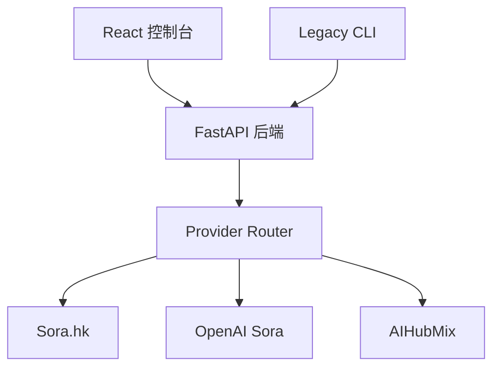

# 🌊 CineFlow (影流) - 视频生成平台（CLI + Web 控制台）

[](https://www.python.org/)
[](LICENSE)
[]()

[**English Documentation**](README.md)

**CineFlow (影流)** 现已升级为包含 **FastAPI 后端** 与 **React/Vite 控制台** 的视频生成平台，同时保留原有 **CLI 流水线** 作为兼容方案。

---

## ✅ 当前状态（Beta）

- Web 控制台 + 后端 API 已完成 **最小闭环**（上传 → 编辑 → 运行 → 重试 → 下载）
- 已完成多服务商抽象（Sora.hk / OpenAI / AIHubMix）
- 已完成真实 Provider 下载验证

商业化所需的 i18n、后台管理能力、持久化、观测与权限体验仍有明显差距，详见下方交付计划。

---

## 🧭 架构（Web + API + Providers）



---

## ✨ 核心能力（当前版本）

- **分镜流程**：上传、列表、编辑、创建运行任务
- **Run/Task 管理**：状态跟踪、重试、元数据下载
- **多 Provider 路由**：逻辑模型 ID → 供应商映射，支持 failover/weighted
- **后台管理**：服务商与模型启用/禁用
- **i18n**：中英文基础覆盖（仍需补全）

---

## 🚀 快速开始（Web 控制台）

### 1) 后端（FastAPI）
```bash
cp .env.example .env
python3 -m venv venv
source venv/bin/activate
pip install -r requirements.txt

# 启动后端
uvicorn backend.app.main:app --host 127.0.0.1 --port 8088
```

### 2) 前端（React + Vite）
```bash
cd frontend
npm install
VITE_API_BASE=http://127.0.0.1:8088/api/v1 npm run dev
```

若 `.env` 中开启 `AUTH_TOKEN`，需额外配置：
```bash
VITE_AUTH_TOKEN=your_token_here
```

浏览器访问：`http://127.0.0.1:3000/`

---

## ⚙️ 配置说明 (.env)

关键字段如下（完整列表见 `.env.example`）：

```ini
SORA_API_KEY=...
OPENAI_API_KEY=...
AIHUBMIX_API_KEY=...

AUTH_TOKEN=         # 可选，开启 Bearer 鉴权
CORS_ALLOW_ORIGINS=*
```

---

## 🧪 验收与文档

- 真实 Provider 下载验收：`docs/backend_integration_acceptance_actual.md`
- OpenAPI 草案：`docs/openapi_draft.yaml`
- 前端功能规格：`docs/frontend_functional_spec.md`
- Provider 路由策略：`docs/provider_strategy.md`
- 版本交付模板：`docs/release_delivery_template.md`
- 当前交付说明：`docs/release_delivery_current.md`
- 版本发布说明：`docs/release_notes_v0.2-beta.md`
- 变更记录：`docs/CHANGELOG.md`

---

## 🧰 兼容 CLI 模式（仍可用）

```bash
python main.py
python main.py --dry-run
python main.py --input-dir "/path/to/project" --output-mode in_place
```

---

## 📂 目录结构（简化）

```text
CineFlow/
├── backend/                # FastAPI 后端
├── frontend/               # React + Vite 控制台
├── src/                    # Legacy CLI 流水线
├── input/                  # 分镜模板
├── docs/                   # 规范、OpenAPI、验收
├── .env.example
└── main.py
```

---

## 🧭 下一阶段重点

- i18n 完整覆盖与验收
- 管理后台扩展（priority/weight/mapping）
- `/client-events` 异常上报接入
- 认证与权限体验完善
- 数据持久化与观测
- 部署与回滚流程标准化

---

## 🤝 贡献

欢迎提交 Issue 和 PR，请勿提交真实 API Key。

---

## 📝 License

MIT License，详见 [LICENSE](LICENSE)。
